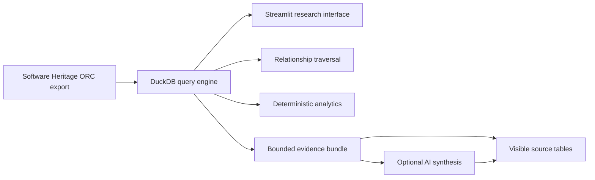

# Software Heritage Research Explorer

**An experimental, local-first interface for exploring Software Heritage graph exports and investigating evidence-grounded AI workflows for software-history research.**

This project began as a small Streamlit utility for inspecting a Software Heritage teaser dataset. I rebuilt it to answer a more useful question:

> How far can a researcher go using public Software Heritage data, local analytical tooling, persistent identifiers, and a carefully bounded AI layer—without privileged archive infrastructure?

The result is a research prototype that treats Software Heritage as a **graph of archived software objects**, not simply a set of ORC files.

## Live Link

https://software-heritage-research-explorer.streamlit.app/

## What it does

### Dataset Explorer

- Discovers ORC-backed tables automatically.
- Inspects table schemas without hard-coded local paths.
- Runs constrained, parameterized filters through DuckDB.
- Projects selected columns and exports bounded results to CSV.
- Avoids loading whole graph tables into pandas just to inspect them.

### Graph Relationships

The explorer follows relationships encoded by the Software Heritage graph export:

```text
Origin → Visit → Snapshot → Branch → Revision → Directory → Content
                                  ↘ Parent revisions
```

Current traversal workflows include:

- revision → ordered parents
- revision → children
- snapshot → branches and target types
- directory → entries and targets

### Archive Analytics

Initial reproducible analytical views include:

- revisions by month
- revision parent-count / merge distribution
- content-size summary statistics

These are intentionally deterministic. The archive queries remain the source of truth.

### SWHID Inspector

Paste a version-1 Software Heritage persistent identifier such as:

```text
swh:1:rev:0123456789abcdef0123456789abcdef01234567
```

The inspector:

- validates and parses the identifier
- identifies the corresponding Software Heritage object type
- constructs the canonical archive browse URL
- optionally looks up the object in the connected local export

### Evidence-Grounded AI Research

The AI page is **not a generic chatbot over the archive**.

Instead:

1. deterministic DuckDB queries retrieve the relevant archive records;
2. those records become a bounded evidence bundle;
3. the optional model receives only the user's question plus that evidence;
4. the generated brief is displayed alongside the exact source tables.

Current workflows can build grounded briefs for a revision, snapshot, directory, or aggregate revision activity.

If no OpenAI API key is configured, the evidence-building workflow still works and no model call is made.

## Architecture



See [`docs/ARCHITECTURE.md`](docs/ARCHITECTURE.md) and [`docs/DESIGN_DECISIONS.md`](docs/DESIGN_DECISIONS.md) for the reasoning behind the implementation.

## Repository structure

```text
.
├── app.py
├── pages/
│   ├── 1_Dataset_Explorer.py
│   ├── 2_Graph_Relationships.py
│   ├── 3_Archive_Analytics.py
│   ├── 4_SWHID_Inspector.py
│   └── 5_AI_Research.py
├── src/
│   ├── analytics.py
│   ├── catalog.py
│   ├── config.py
│   ├── query_engine.py
│   ├── research.py
│   ├── sql_utils.py
│   ├── swhid.py
│   └── ui.py
├── scripts/
│   └── build_catalog.py
├── tests/
├── docs/
├── .env.example
├── requirements.txt
└── pyproject.toml
```

## Run locally

Python 3.10+ is recommended.

```bash
python -m venv .venv
source .venv/bin/activate
pip install -r requirements.txt
cp .env.example .env
streamlit run app.py
```

On Windows PowerShell:

```powershell
python -m venv .venv
.\.venv\Scripts\Activate.ps1
pip install -r requirements.txt
Copy-Item .env.example .env
streamlit run app.py
```

The app accepts the dataset path in the Streamlit sidebar, so editing `.env` is optional.

## Dataset configuration

Point the explorer at the directory that contains Software Heritage graph-export table directories:

```text
/path/to/orc/
├── content/
├── directory/
├── directory_entry/
├── revision/
├── revision_history/
├── snapshot/
├── snapshot_branch/
└── ...
```

You can configure this in `.env`:

```text
SWH_DATASET_PATH=/absolute/path/to/orc
```

Large Software Heritage exports are intentionally excluded from Git through `.gitignore`.

## Optional AI configuration

Set:

```text
OPENAI_API_KEY=...
OPENAI_MODEL=gpt-5.5
```

The implementation uses the OpenAI Responses API. The model name is configurable because model availability changes over time.

The AI layer is optional; every core archive-exploration feature is independent of it.

## Build a local table catalog

For a connected export:

```bash
python scripts/build_catalog.py /path/to/orc --output table_summary.csv
```

This computes table row counts through the same DuckDB query layer used by the app.

## Tests

```bash
pip install -r requirements-dev.txt
pytest
ruff check .
```

## Design principles

**Archive first.** Software Heritage objects and relationships are authoritative; generated text is not.

**Graph aware.** The UI should expose revision ancestry, snapshot branches, directory structure, and other relationships instead of treating tables independently.

**Local first.** Public exports can be explored without uploading archive data to an external model provider.

**Ground AI in evidence.** When AI is enabled, deterministic retrieval happens before generation and the evidence remains visible to the researcher.

**Do not simulate unavailable infrastructure.** This repository documents what cannot be inferred from a local teaser/export instead of pretending to reproduce internal archive capabilities.

## Software Heritage references

- Documentation: https://docs.softwareheritage.org/
- Graph datasets: https://docs.softwareheritage.org/devel/swh-dataset/graph/dataset.html
- Graph relational schema: https://docs.softwareheritage.org/devel/swh-export/graph/schema.html
- SWHID specification: https://docs.softwareheritage.org/devel/swh-model/persistent-identifiers.html
- Archive: https://archive.softwareheritage.org/

## Status

Research prototype. The immediate roadmap is documented in [`docs/ROADMAP.md`](docs/ROADMAP.md), including origin-to-snapshot traversal, recursive directory exploration, richer revision-topology analysis, and integration fixtures.

## License

MIT. See [`LICENSE`](LICENSE).
