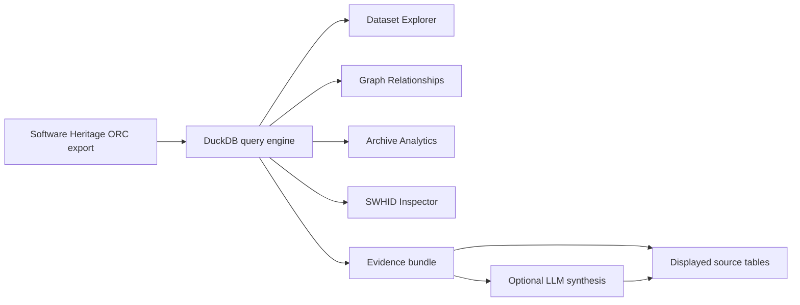

# Architecture

The explorer is intentionally split into a deterministic archive layer and an optional generative-analysis layer.

## Components

- `src/query_engine.py` owns all ORC access. It discovers tables, validates table/column names, performs parameterized filters, and contains graph-specific queries.
- `src/swhid.py` performs local SWHID parsing and maps core object types to graph-export tables.
- `src/analytics.py` contains deterministic transformations over query results.
- `src/research.py` serializes bounded evidence frames and optionally asks an LLM to synthesize them.
- `pages/` contains thin Streamlit views. The pages do not directly read ORC files.

## Why DuckDB

The Software Heritage columnar exports are large. Loading a whole ORC table into pandas simply to inspect a few rows does not scale. DuckDB can push projection, filtering and aggregation into the scan and only materialize the result required by the UI.

## Trust boundary

The archive data is authoritative. The AI layer is downstream of deterministic retrieval and never replaces an identifier lookup, relationship query, count, or aggregate. Every model-generated research brief is accompanied by the evidence frames used to produce it.
